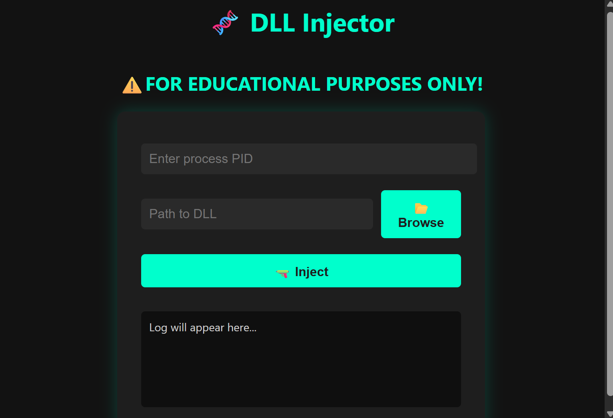

# 🧬 DLL Injector (Python + WebView)

A minimalist GUI-based DLL injector built with Python and pywebview. Designed for educational and testing purposes, this tool allows you to inject a DLL into a running Windows process using `ctypes` and `CreateRemoteThread`.

> ⚠️ This project is intended for educational use only. Do not use it for malicious purposes.

---

## 🚀 Getting Started

### 🔧 Requirements

- Python 3.8+
- Windows OS
- `pip install pywebview`

### ▶️ Run the Injector

```bash
python injector_gui.py
```
---


